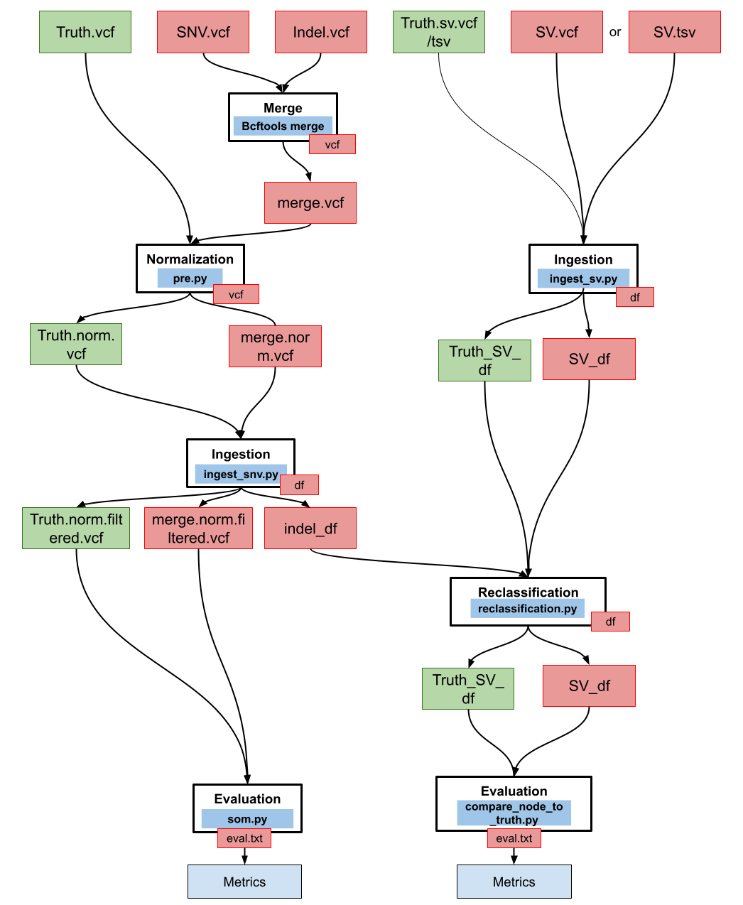

# Scripts

Scripts in this folder have two main purpose:
- parsing and benchmarking snv
- parsing and benchmarking sv

## List of scripts:
### SV related:
- `compare_node_to_truth.py`
- `ingest.py`
- `parse_sv_tsv.py`
- `parse_sv_vcf.py`
- `reclassification.py`

### SNV related:

- `ingest_snv.py`
- `parse_snv.py`
- `ingest_snv.sh`

## Tool summary

<center>

</center>


### SV Benchmark

**requirements**

This tool is implemented in `python3` and require several libraries such as `pandas`,`pyVCF` and `argsParse`.
A `conda` environment is provided.
To use it, simply use:

```shell
conda env create --name ingestion python=3.6 -f environment.yml
conda activate ingestion
```

Add any new requirement for your code to [environment.yml](https://github.com/EUCANCan/golden-datasets/blob/devel/scripts/environment.yml) (if it is compatible)

#### Usage

**1) Ingestion**

Creates dataframes from VCF/TSV files. This step is required both for test files and truth files.
Flag `-samplename` is required for VCF files and must contain the Tumor sample name

```shell
python ingest.py VCF_FILE -outputfile DATAFRAME_FILE
```


**2) Benchmarking**

Computes metrics for SV calls. Optional: `-metrics` flag to print result to a file

```shell
python compare_node_to_truth.py DATAFRAME_TEST DATAFRAME_TRUTH -metrics OUTPUT_METRICS_FILE
```

**implementation**

### SNV Benchmark

**requirements**

This tool is implemented in `bash` and `python3` and require several associated tools and libraries such as `bcftools`,`hap.py` and `pyVCF`.
A `conda` environment is provided.
To use it, simply use:

```shell
conda create -n snv_bench -f golden-datasets/scripts/environment_snv.yml
conda activate snv_bench
```

**implementation**

To benchmark snv calls from different centers, multipe steps are required:

- perparing and normalizing test and truth vcfs with `bcftools`, `multimerge` and `pre.py`
- extracting indels > 50bp so they can be assessed as SV with `ingest_snv.py`
- benchmarking each snv file to the truth file with `som.py`

**Usage**

```
bash ingest_snv.sh -h
bash tmb_dragon.sh -t truth_file.vcf
                   -s snv.vcf
                   -i indel.vcf
                   -f ref_fasta.fa
                   -o /OUTPUT_DIR/PATH
                   -n Sample name
                   -k (to keep intermediates files)

```
